<div align="center">
    
</div>

# Bora: Biomedical Generalist Video Generation Model

[Weixiang Sun](https://weixiang-sun.github.io/)<sup>1*</sup>, [Xiaocao You](https://xiaocao.me/)<sup>2*</sup>, [Ruizhe Zheng](https://jonbarron.info)<sup>3*</sup>, [Zhengqing Yuan](https://dlyuangod.github.io/zhengqingyuan/)<sup>4</sup>, [Xiang Li](https://xiangli-shaun.github.io/)<sup>5</sup>, [Lifang He](https://engineering.lehigh.edu/faculty/lifang-he)<sup>6</sup>, [Quanzheng Li](https://researchers.mgh.harvard.edu/profile/4211743/Quanzheng-Li)<sup>5</sup>, [Lichao Sun](https://lichao-sun.github.io/)<sup>6</sup>

<sup>1</sup>Northeastern University, <sup>2</sup>Shanghai University of Finance and Economics, <sup>3</sup>Fudan University, <sup>4</sup>University of Notre Dame, <sup>5</sup>Massachusetts General Hospital and Harvard Medical School, <sup>6</sup>Lehigh University


<div align="center">
    <a href="https://github.com/Weixiang-Sun/Bora/stargazers"></a>
    <a href="https://weixiang-sun.github.io/Bora/"></a>
    <a href="https://weixiang-sun.github.io/Bora/"></a>
    <a href="https://huggingface.co/Sweson/Bora"></a>
</div>


<!-- **Abstract:** Generative models hold promise for revolutionizing medical education, robot-assisted surgery, and data augmentation for medical AI development. Diffusion models can now generate realistic images from text prompts, while recent advancements have demonstrated their ability to create diverse, high-quality videos. However, these models often struggle with generating accurate representations of medical procedures and detailed anatomical structures. This paper introduces Bora, the first spatio-temporal diffusion probabilistic model designed for text-guided biomedical video generation. Bora leverages Transformer architecture and is pre-trained on general-purpose video generation tasks. It is fine-tuned through model alignment and instruction tuning using a newly established medical video corpus, which includes paired text-video data from various biomedical fields. To the best of our knowledge, this is the first attempt to establish such a comprehensive annotated biomedical video dataset. Bora is capable of generating high-quality video data across four distinct biomedical domains, adhering to medical expert standards and demonstrating consistency and diversity. This generalist video generative model holds significant potential for enhancing medical consultation and decision-making, particularly in resource-limited settings. Additionally, Bora could pave the way for immersive medical training and procedure planning. Extensive experiments on distinct medical modalities such as endoscopy, ultrasound, MRI, and cell tracking validate the effectiveness of our model in understanding biomedical instructions and its superior performance across subjects compared to state-of-the-art generation models. -->

## 📰 News
- **[2024.6.19]** We release **Bora**, a video generation model specificaly for biomedical domain.

## 🎥 Some Demos
| Endoscopy | Ultrasound | RT-MRI | Cell |
| ------ | ------ | ------ | ------ |
| 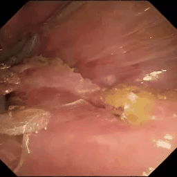 | 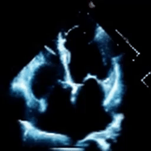 | 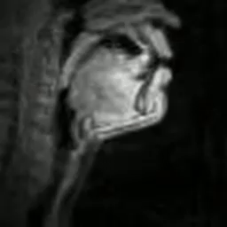 | 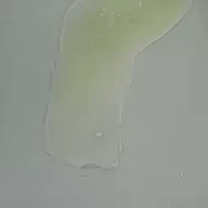 |
| 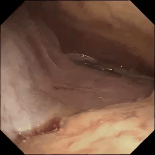 | 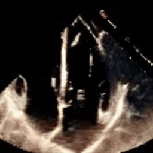 | 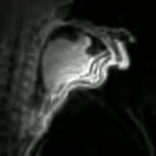 | 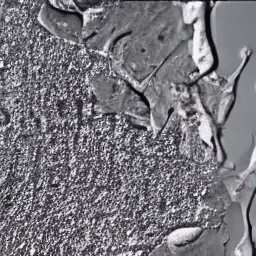 |
| 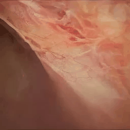 | 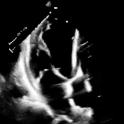 | 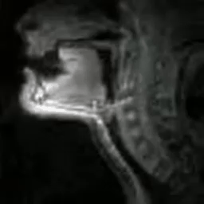 |  |

## Contents
- [Installation](#installation)
- [Prepare](#prepare)
- [Inference](#inference)
- [Training](#training)
- [Citation](#citation)
- [Acknowledgement](#acknowledgement)
- [Star History](#star-history)

## Installation
```bash
# create a virtual env
conda create -n bora python=3.10
# activate virtual environment
conda activate bora
# install torch
# We recommend torch==2.2.2 under CUDA12.1
pip install torch torchvision

# install flash attention
pip install packaging ninja
pip install flash-attn --no-build-isolation

# install apex
# We recommend install from source
git clone https://github.com/NVIDIA/apex.git
cd apex
pip install -v --disable-pip-version-check --no-cache-dir --no-build-isolation --config-settings "--build-option=--cpp_ext" --config-settings "--build-option=--cuda_ext" ./

# install xformers
pip install -U xformers --index-url https://download.pytorch.org/whl/cu121

# install opensora
pip install -v .
```

## Prepare
Before running, besides Bora's weights, you also need to download the weights for the VAE and Text Encoder. We have provided all the links in the table below:
|Bora|Video Encoder|Text Encoder|
|----|----|----|
|[Bora](https://huggingface.co/Sweson/Bora)|[VAE](https://huggingface.co/stabilityai/sd-vae-ft-ema)|[T5](https://huggingface.co/DeepFloyd/t5-v1_1-xxl)|

## Inference
```bash
# on single card
torchrun --standalone --nproc_per_node 1 scripts/inference.py configs/infer.py --ckpt-path Bora_CKPT

# on multi cards
torchrun --standalone --nproc_per_node N scripts/inference.py configs/infer.py --ckpt-path Bora_CKPT
```

## Train
```bash
# on four cards
torchrun --nnodes=1 --nproc_per_node=4 scripts/train_origin.py configs/train.py --data-path CSV_PATH --ckpt-path Bora_CKPT
```
To launch training on multiple nodes, prepare a hostfile according
to [ColossalAI](https://colossalai.org/docs/basics/launch_colossalai/#launch-with-colossal-ai-cli), and run the
following commands.
```bash
colossalai run --nproc_per_node 8 --hostfile hostfile scripts/train_origin.py configs/train.py --data-path CSV_PATH --ckpt-path Bora_CKPT
```

## Citation
If you're using Bora in your research or applications, please cite using this BibTeX:
```bibtex
@article{sun2024bora,
  title={Bora: Biomedical Generalist Video Generation Model},
  author={Sun, Weixiang and You, Xiaocao and Zheng, Ruizhe and Yuan, Zhengqing and Li, Xiang and He, Lifang and Li, Quanzheng and Sun, Lichao},
  journal={arXiv preprint arXiv:2407.08944},
  year={2024}
}
```


## Acknowledgement
We are greatful for the following works and generous contribution to open source.

[Open-Sora](https://github.com/hpcaitech/Open-Sora): Democratizing Efficient Video Production for All

[LLaVA](https://github.com/haotian-liu/LLaVA): Large Language and Vision Assistant

[Apex](https://github.com/NVIDIA/apex): A PyTorch Extension: Tools for easy mixed precision and distributed training in Pytorch


## Star History

<a href="https://star-history.com/#Weixiang-Sun/Bora&Date">
 <picture>
   <source media="(prefers-color-scheme: dark)" srcset="https://api.star-history.com/svg?repos=Weixiang-Sun/Bora&type=Date&theme=dark" />
   <source media="(prefers-color-scheme: light)" srcset="https://api.star-history.com/svg?repos=Weixiang-Sun/Bora&type=Date" />
   
 </picture>
</a>